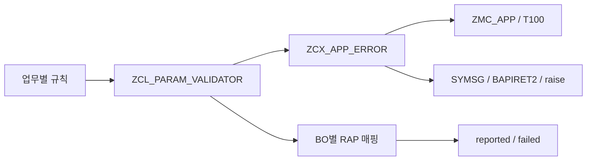

# 구조

- Validator는 규칙 primitive와 위반 목록을 관리합니다.
- 예외 클래스는 메시지 ID·변수·심각도·previous 및 외부 메시지 변환을 맡습니다.
- 예제의 `lcl_order_rules`는 주문 규칙을, Handler는 RAP 요청·응답 배선을 맡습니다.
- 공통 클래스는 RAP 핸들러를 모르지만 `IF_ABAP_BEHV_MESSAGE` 타입에는 의존합니다.
- 예제의 동적 `%element` 매핑은 BO 필드에만 적용합니다. 액션 팝업의 파라미터 강조 보장은 없습니다.
- 메시지 객체가 공유되므로 반환 후 심각도 변경을 피합니다. Validator는 단일 호출 범위에서 사용합니다.

실제 주문 저장, unmanaged 버퍼, save sequence, 권한·잠금, UI 서비스 노출은 업무 BO가 구현할 책임입니다.
예제는 검증만 수행하며 DB를 변경하지 않습니다. LLM 실행·코드 생성·자동 수정 하네스는 저장소 범위 밖입니다.
